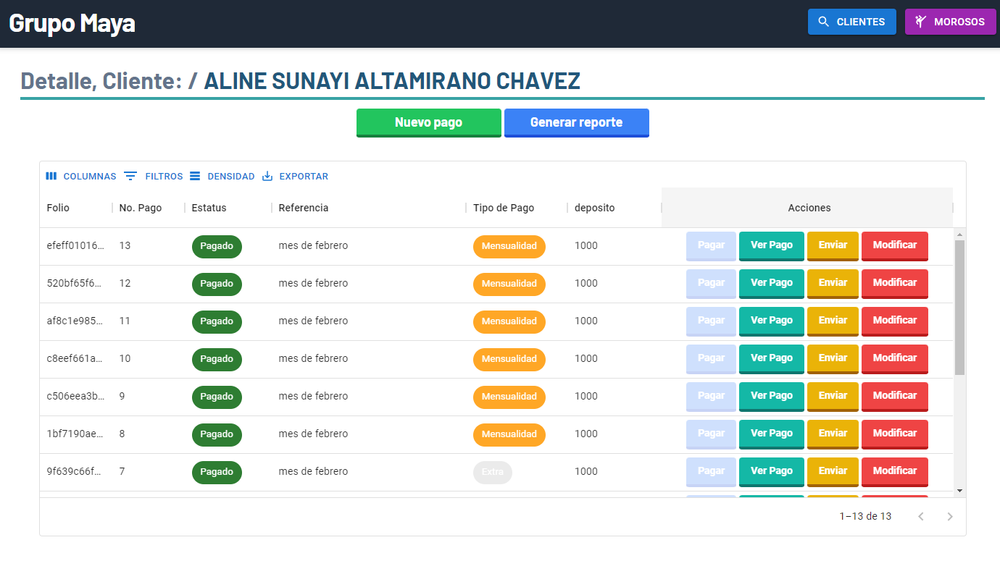

# SISTEMA DE CONTROL DE PAGOS

## Descripción

Sistema de control de pagos de lotes de terreno, con el fin de llevar un control de los pagos realizados por los clientes.

Permite:

- Registrar clientes
- Registrar lotes
- Registrar pagos
- Registrar pagos de lotes
- Registrar pagos de clientes
- Generar reportes de cliente por lotes
- Generar PDF de pago

---

**_Nota:_** Ventana empresas

---

**_Nota:_** Ventana de control de pagos

